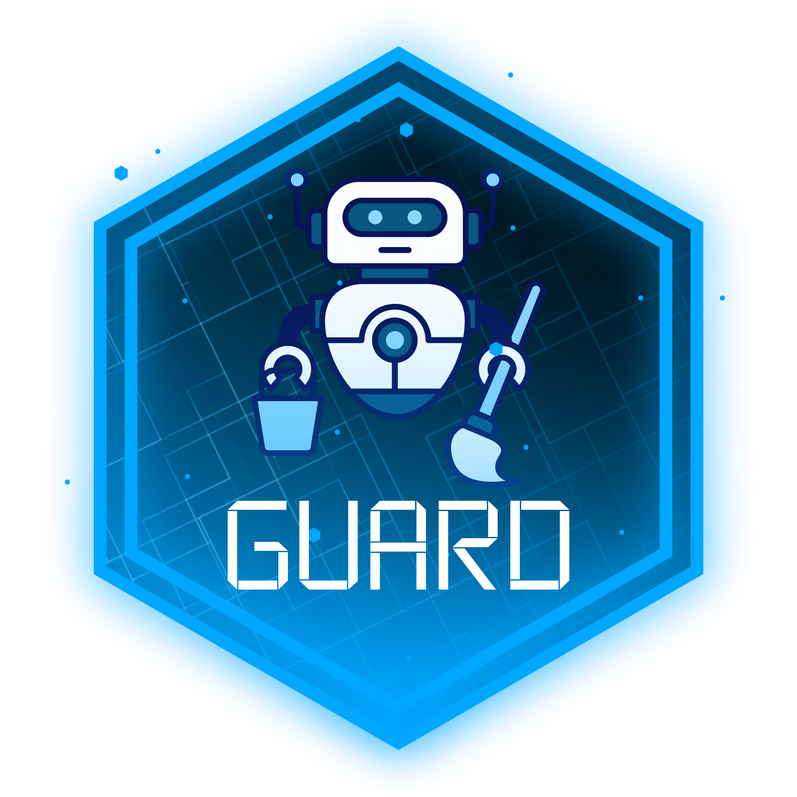

# GUARD 
Greenfield Urban Air Reconnaissance Drones

This is a project developed for the final assignment of the course Distributed and Pervasive Systems - Universitá degli Studi di Milano, AY 2023/2024.

## Aim and specs

In a smart city named Greenfield, a fleet of robots moves around the districts of the city to clean their streets. The city is organised in a grid of 4 quadrants - a robot is assigned to one of the districts while one district can contain more than one robot.
The robots periodically detect, through an onboard sensor, the pollution levels of the city. These levels are to be transmitted to a server that then is able to compute statistics on them and expose an interface to interact with an administrator.

* Implement a distributed application for the management of a fleet of cleaning robots
* The application is composed of 3 parts: the administrator server, the administrator client and a peer-to-peer system for the actual robots' network
* The administrator server exposes a REST API for both robots that want to join the network/leave and for the client to request statistics
* Robots communicate among themselves and coordinate for the use of a shared resource (mechanic for the repairs) - mutual exclusion must be ensured
* Pollution data collected by the robots is communicated to the server through a publish-subscribe mechanism
* Detect and handle crash events in the p2p network
* Automatic load balancing of districts when a robot enters/leaves the city

## Technologies used

* The project is implemented entirely in Java 17 
* MQTT for the publish-subscribe system: the MQTT broker is handled with Eclipse Mosquitto
* The exchange of messages in the peer-to-peer network is implemented with gRPC
* Mutual exclusion in the robots' network is ensured with an implementation of the Ricart and Agrawala algorithm
* REST API implemented with the use of Jersey/JAXB

## Startup instructions

1. Start Mosquitto and Admin Server
On MacOS to start Mosquitto:
```bash
brew services start mosquitto
```
Start the Admin server after navigating to the path of the project

```
cd "/path/to/GUARD"
./gradlew admin-server:run --console=plain
```

2. Start the Admin Client

```
./gradlew admin-client:run --console=plain
```

3. Launch Robots

```
# Launches robot 1
./gradlew robots-network:run -PrunArgs="-i 1 -p 9991" --console=plain

# Launches robot 2
./gradlew robots-network:run -PrunArgs="-i 2 -p 9992" --console=plain

# Launches robot 3
./gradlew robots-network:run -PrunArgs="-i 3 -p 9993" --console=plain

# Launches robot 4
./gradlew robots-network:run -PrunArgs="-i 4 -p 9994" --console=plain

# Launches robot 5
./gradlew robots-network:run -PrunArgs="-i 5 -p 9995" --console=plain

# Launches robot 6
./gradlew robots-network:run -PrunArgs="-i 6 -p 9996" --console=plain

...
```

4. After stopping the application, stop mosquitto

```
brew services stop mosquitto
```

## REST API docs

### Base URL
All API endpoints are relative to this base URL:

```
http://localhost:9090/api
```

## Endpoints
### <span class="text-pill-green">GET</span> `/robots`

Returns a list of active robots in Greenfield.

```
GET http://localhost:9090/api/robots
```

#### Response
Returns a JSON array of robots.

```json
[
	{
		"id": 1,
		"port": 9991,
		"ipAddress": "localhost"
	},
	{
		"id": 2,
		"port": 9992,
		"ipAddress": "localhost"
	}
]
```

### <span class="text-pill-blue">POST</span> `/robots`

Creates a new robot with a given id if the procedure succeeds.
Requests are sent in JSON format with the following structure:

```json
{
	"id": 2,
	"ipAddress": "localhost",
	"port": 9992
}
```

#### Response
If the request succeeds (aka the id of the robot wasn't already present) it returns a JSON response with the following structure: 

```json
{
    "activeRobots": [
        {
            "id": 1,
            "ipAddress": "localhost",
            "port": 9991
        }
    ],
    "identity": {
        "id": 2,
        "ipAddress": "localhost",
        "port": 9992
    },
    "mapPosition": {
        "district": 2,
        "x": 0,
        "y": 7
    }
}
```

If the request fails an error response is returned instead:

```json
{
    "errorMessage": "Robot id already present",
    "statusCode": 409
}
```

### <span class="text-pill-red">DELETE</span> `/robots/{id}`

Deletes the robot with the given id.

```
DELETE http://localhost:9090/api/robots/{id}
```

#### Response
Returns just a status code:
- 200 if the robot was deleted successfully
- 404 Not Found if the robot with the given id doesn't exist

### <span class="text-pill-peach">PUT</span> `/robots

Updates the position in Greenfield map of the robots included in the body of the message. Requests are formatted in JSON format as follows:

```json
[
	{
		"robotId": 1,
		"mapPosition": {
			"district": 2,
			"x": 3,
			"y": 8
		}
	},
	{
		"robotId": 4,
		"mapPosition": {
			"district": 1,
			"x": 1,
			"y": 3
		}
	},
	...
]
```

#### Response
If position changed returns a response with status code 200.

### <span class="text-pill-green">GET</span> `/pollution/{id}`

Returns the average value of the last N measurements for the robot with the selected id.

#### Query parameters
- `n`  (int): the number of measurements to consider. Must be a positive number greater or equal to 1.

```
GET http://localhost:9090/api/pollution/1?n=10
```

#### Response
- Response with status 200 and the average value as entity if the request was successful
- Empty response with status 400 if n <= 0
- Empty response with status 404 if there is no data available for the selected robot id

### <span class="text-pill-green">GET</span> `/pollution/`

Gets the average value (for all robots) of measurements between timestamp 1 and timestamp 2.

#### Query parameters
- `t1` (long): timestamp 1
- `t2` (long): timestamp 2

#### Response
- Response with status 200 and average value as entity
